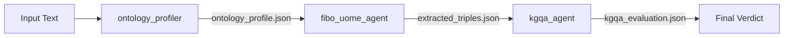

# FIBO ADK MVP 실행 가이드

이 문서는 `app/agent.py`에 구현된 **Ontology 기반 FIBO 추출 MVP**를 로컬에서 실행하고 확장하는 방법을 정리한 사용자 설명서입니다. 기본 아키텍처는 README에 소개된 3단계 플로우(온톨로지 판별 → FIBO 추출 → KGQA 검증)를 그대로 따르며, [Google Gemini ADK](https://github.com/google/adk-samples/tree/main/python/agents/gemini-fullstack)의 경량 패턴을 사용합니다.

---

## 1. 디렉터리 개요

| 경로 | 역할 |
| --- | --- |
| `app/config.py` | 모델 이름 및 Gemini API 환경 변수 설정 (기본 모델: `gemini-2.5-flash-lite`) |
| `app/agent.py` | `FiboOntologyPipeline` (SequentialAgent 상속) 파이프라인 정의 (profiler → extractor → kgqa) |
| `prompts/*.md` | 각 서브 에이전트가 참조하는 온톨로지 지침 |
| `scripts/demo_pipeline.py` | InMemoryRunner로 파이프라인을 빠르게 실행하는 CLI (산출물 자동 저장) |
| `samples/finance_sample.txt` | 약 1,000자 분량의 테스트용 금융 텍스트 |
| `runs/run-*/` | 실행 시마다 생성되는 산출물 디렉터리 |

---

## 2. 설치

필수 요구 사항: **Python 3.10~3.12**, `uv` 또는 `pip`

```bash
# uv 권장
curl -LsSf https://astral.sh/uv/install.sh | sh
uv sync

# 또는 pip
python -m venv .venv && source .venv/bin/activate
pip install -e .
```

---

## 3. 자격 증명 설정

### 3.1 Google AI Studio API Key (필수)
```bash
cd app
cat <<'EOF' > .env
GOOGLE_GENAI_USE_VERTEXAI=FALSE
GOOGLE_API_KEY=YOUR_AI_STUDIO_KEY
EOF
```

> **주의**: 코드 레벨에서 `GOOGLE_GENAI_USE_VERTEXAI=False`가 강제되므로 Vertex AI 경로는 지원하지 않습니다.

---

## 4. 실행 방법

### 4.1 빠른 로컬 실행 (권장 테스트)
```bash
uv run python scripts/demo_pipeline.py --text "여기에 비정형 금융 텍스트를 붙여넣습니다"
# 또는 txt 파일 입력
uv run python scripts/demo_pipeline.py --text-file samples/finance_sample.txt
# 산출물 저장 경로를 직접 지정
uv run python scripts/demo_pipeline.py --text-file samples/finance_sample.txt --output-dir runs/custom-test
```

출력에는 `ontology_profiler`, `fibo_uome_agent`, `kgqa_agent`가 연속적으로 생성한 JSON이 합쳐져 제공됩니다. `scripts/demo_pipeline.py`는 `.env`를 자동으로 불러오고, ADK `InMemoryRunner`를 사용해 단일 세션을 실행하며, 모든 중간 산출물을 `runs/run-YYYYmmdd-HHMMSS/`(또는 `--output-dir`)에 저장합니다.

#### 4.1.1 산출물 구조 & 플로우



| 파일 | 설명 | JSON 구조 예시 |
| --- | --- | --- |
| `input.txt` | 실행에 사용한 원문 | - |
| `ontology_profile.json` | 온톨로지 선정 결과 및 증거 | `{"selected_ontology": "FIBO", "confidence": 1.0, "justification": "...", "candidate_entities": [...], "source_text": "..."}` |
| `extracted_triples.json` | 추출된 FIBO 트리플 | `{"triples": [{"subject": "...", "subject_class": "CorporateBody", "predicate": "hasRevenueFrom", "object": "...", "object_class": "RevenueType", "source_snippet": "...", "confidence": 0.9}], "notes": ""}` |
| `kgqa_evaluation.json` | 검증 결과, 이슈 및 수정 제안 | `{"is_grounded": true, "is_schema_consistent": true, "missing_triples_found": false, "issues": [], "suggested_fixes": [], "verdict": "..."}` |
| `final_response.json` | LLM 최종 응답(가능 시 JSON 파싱) | KGQA 평가 결과와 동일 |
| `session_state.json` | 세션 전체 상태(추후 디버깅/재현용) | `{"ontology_profile": {...}, "extracted_triples": {...}, "kgqa_evaluation": {...}}` |

### 4.2 ADK API 서버 (엔드투엔드 서비스)
```bash
uv run adk api_server app --port 8080
```
- `/v1alpha/sessions` 및 `/v1alpha/messages` 엔드포인트를 통해 임의의 UI나 외부 서비스와 연동할 수 있습니다.
- 필요 시 `adk web app` 명령으로 스트리밍 Playground UI를 띄울 수 있습니다.

---

## 5. 파이프라인 세부 동작

1. **ontology_profiler** (`LlmAgent`)  
   - **입력**: 사용자 텍스트  
   - **프롬프트**: `prompts/ontology_selector.md`  
   - **출력**: `ontology_profile` (세션 상태 키)  
   - **JSON 구조**: `selected_ontology` (FIBO/Schema.org), `confidence` (0.0-1.0), `justification`, `candidate_entities[]`, `source_text`  
   - **역할**: 텍스트 분석 후 적합한 온톨로지 선택 및 원문 보존

2. **fibo_uome_agent** (`LlmAgent`)  
   - **입력**: `{ontology_profile}` (세션 상태에서 자동 주입)  
   - **프롬프트**: `prompts/uome_prompt.md`  
   - **출력**: `extracted_triples` (세션 상태 키)  
   - **JSON 구조**: `triples[]` (각 triple: `subject`, `subject_class`, `predicate`, `object`, `object_class`, `source_snippet`, `confidence`), `notes`  
   - **역할**: FIBO 스키마(`CorporateBody`, `FinancialInstrument`, `RevenueType`, `hasRevenueFrom`, `hasFinancialInstrument`)만 사용하여 구조화된 트리플 추출

3. **kgqa_agent** (`LlmAgent`)  
   - **입력**: `{ontology_profile}`, `{extracted_triples}` (세션 상태에서 자동 주입)  
   - **프롬프트**: `prompts/kgqa_prompt.md`  
   - **출력**: `kgqa_evaluation` (세션 상태 키)  
   - **JSON 구조**: `is_grounded`, `is_schema_consistent`, `missing_triples_found`, `issues[]`, `suggested_fixes[]`, `verdict`  
   - **역할**: 추출된 트리플의 정확성(Grounding), 스키마 일관성, 완성도 검증

모든 서브 에이전트는 JSON만 출력하도록 설계되어 있어 후속 파이프라인(예: DozerDB 적재, GraphDB)에 바로 연결할 수 있습니다. 각 에이전트의 출력은 `output_key`로 지정된 세션 상태 키에 저장되며, 다음 에이전트가 자동으로 참조합니다.

---

## 6. 주요 설정 포인트

| 환경 변수 | 설명 | 기본값 |
| --- | --- | --- |
| `ONTOLOGY_SELECTOR_MODEL` | `ontology_profiler`에서 사용할 모델 | `gemini-2.5-flash-lite` |
| `ONTOLOGY_EXTRACTOR_MODEL` | FIBO triple 추출 모델 | `gemini-2.5-flash-lite` |
| `ONTOLOGY_VALIDATOR_MODEL` | KGQA 검증 모델 | `gemini-2.5-flash-lite` |
| `ONTOLOGY_MAX_TRIPLES` | 한 번에 반환할 triple 상한 | `6` |
| `GOOGLE_API_KEY` | Google AI Studio API 키 (필수) | - |
| `GOOGLE_GENAI_USE_VERTEXAI` | Vertex AI 사용 여부 (코드에서 `False`로 강제) | `False` |

필요 시 `.env`에 위 변수를 추가하면 됩니다.

---

## 7. 다음 단계 아이디어
1. **Ontology Selector 확장** – Schema.org, HL7 등 추가 옵션을 `prompts/ontology_selector.md`에 선언하고, `root_agent`에 분기 로직을 추가합니다.
2. **도구 통합** – `FunctionTool`을 통해 `0000.parquet`에서 자동으로 샘플 텍스트를 가져오는 함수를 추가하면 완전한 노코드 경험을 만들 수 있습니다.
3. **품질 루프 강화** – `LoopAgent`를 사용해 KGQA 실패 시 `fibo_uome_agent`를 자동으로 재호출하도록 확장할 수 있습니다.

필요한 커스터마이징 포인트는 모두 `app/agent.py`의 `FiboOntologyPipeline` 서브 에이전트 정의와 `prompts/` 파일에 모여 있습니다.

## 8. 실제 구현 세부사항

### 8.1 에이전트 클래스 구조
- **루트 에이전트**: `FiboOntologyPipeline` (`app/agent.py:66-77`)
  - `google.adk.agents.SequentialAgent`를 상속
  - `sub_agents=[ontology_profiler, fibo_extractor, kgqa_agent]` 순서로 실행
- **서브 에이전트**: 모두 `LlmAgent` 타입
  - 각 에이전트는 `output_key`로 세션 상태에 결과 저장
  - 다음 에이전트는 `{output_key}` 형식으로 이전 결과 참조

### 8.2 세션 상태 흐름
```
사용자 입력
  ↓
ontology_profiler → session.state["ontology_profile"]
  ↓
fibo_uome_agent → session.state["extracted_triples"] (ontology_profile 참조)
  ↓
kgqa_agent → session.state["kgqa_evaluation"] (ontology_profile, extracted_triples 참조)
  ↓
최종 응답
```

### 8.3 산출물 저장 위치
- 기본 경로: `runs/run-YYYYmmdd-HHMMSS/`
- CLI 옵션: `--output-dir`로 커스텀 경로 지정 가능
- 저장 시점: 파이프라인 완료 후 자동 저장
