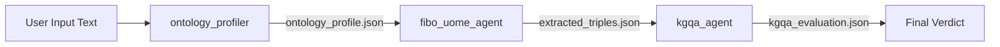

# Seocho Graph-Ontology Agent Framework

🎯 프로젝트 개요 (Project Overview)

이 프로젝트는 금융 비정형 데이터를 FIBO (Financial Industry Business Ontology) 기반의 구조화된 지식 그래프 트리플로 변환하는 모듈형 에이전트 프레임워크입니다.

우리는 LLM에게 프롬프트를 지식 추출의 **'온톨로지(Ontology)'**로 개념화하여 주입하며, 사용자가 자신의 데이터 도메인에 맞는 온톨로지를 쉽게 적용하고, 그 품질을 검증할 수 있도록 설계되었습니다.

🧱 핵심 에이전트 플로우 (Core Agent Flow)

이 프레임워크는 3가지 핵심 단계와 2가지 에이전트로 구성됩니다.

1. 🔍 도메인 판별 및 온톨로지 선택 (Data Preparation Agent)

역할: 사용자 데이터(0000.parquet 등)의 소량 샘플을 분석하여 가장 적합한 **웹 표준 온톨로지(FIBO, Schema.org 등)**를 판별하고 추천합니다.

결과: 해당 온톨로지를 기반으로 작성된 '프롬프트 템플릿' 파일(예: prompts/fibo_base.md)을 준비합니다.

2. 🤖 온톨로지 기반 추출 에이전트 (UOME Agent, Universal Ontology Mapper & Extractor)

역할: 비정형 텍스트를 FIBO 스키마 기반의 JSON 트리플로 변환합니다.

활용: prompts/uome_prompt.md에 정의된 FIBO 프롬프트 온톨로지를 LLM의 시스템 지침으로 사용합니다.

3. ✅ 온톨로지 평가 에이전트 (KGQA Agent)

역할: UOME가 생성한 트리플의 품질(정확성, 일관성)을 검증합니다.

활용: prompts/kgqa_prompt.md에 정의된 QA 템플릿을 실행하여 평가하며, 추출 오류에 대한 자가 수정(Self-Correction) 피드백을 UOME에게 제공합니다.

💡 Quick Start: 프롬프트 온톨로지 테스트

이 프로젝트의 핵심은 프롬프트 파일에 있습니다. 사용자는 다음 두 프롬프트 파일을 LLM Agent Builder에 적용하여 테스트를 시작할 수 있습니다.

추출 정의: prompts/uome_prompt.md를 시스템 지침으로 설정합니다.

검증 정의: prompts/kgqa_prompt.md를 Tool 호출 후 검증 또는 두 번째 에이전트의 지침으로 설정합니다.

# 🧪 ADK 기반 FIBO MVP

`app/agent.py`에는 Google Gemini ADK의 `FiboOntologyPipeline` (SequentialAgent 상속) 클래스를 사용한 3단계 파이프라인이 구현되어 있습니다.

- **구현 클래스**: `FiboOntologyPipeline` - `google.adk.agents.SequentialAgent`를 상속하여 프로젝트 스코프의 에이전트로 정의
- **파이프라인**: `ontology_profiler` → `fibo_uome_agent` → `kgqa_agent` 3단계 순차 실행
- **모델 설정**: 기본값은 `gemini-2.5-flash-lite` (환경 변수로 변경 가능)
- **프롬프트**: 모든 프롬프트는 `prompts/` 디렉터리에 Markdown으로 정리되어 있어 Agent Builder나 다른 실행 환경에서도 재사용 가능
- **실행 방법**: [MVP_GUIDE.md](MVP_GUIDE.md)에서 단계별로 정리

이 구조를 그대로 확장하면 Vertex AI Agent Builder, Agent Engine 또는 Cloud Run 배포 파이프라인에 손쉽게 연결할 수 있습니다.

## 📈 Pipeline Flow & Artifacts

`scripts/demo_pipeline.py` 실행 시마다 `runs/run-YYYYmmdd-HHMMSS/` 아래에 아래 산출물이 자동 저장됩니다.

| 파일 | 내용 | 주요 필드 |
| --- | --- | --- |
| `input.txt` | 실행에 사용한 원문 | - |
| `ontology_profile.json` | 온톨로지 선정 결과 | `selected_ontology`, `confidence`, `justification`, `candidate_entities`, `source_text` |
| `extracted_triples.json` | 추출된 FIBO 트리플 | `triples[]` (각 triple: `subject`, `subject_class`, `predicate`, `object`, `object_class`, `source_snippet`, `confidence`), `notes` |
| `kgqa_evaluation.json` | 검증 결과 및 수정 제안 | `is_grounded`, `is_schema_consistent`, `missing_triples_found`, `issues[]`, `suggested_fixes[]`, `verdict` |
| `final_response.json` | 마지막 LLM 응답 | KGQA 평가 결과 (JSON 파싱됨) |
| `session_state.json` | 전체 세션 상태 스냅샷 | `ontology_profile`, `extracted_triples`, `kgqa_evaluation` 등 모든 중간 상태 |

CLI는 `--output-dir`로 경로를 지정할 수 있으며, 기본값은 `runs/run-타임스탬프`입니다.

# 구현 가이드라인
**Agent Builder**를 활용하여 온톨로지 기반의 추출 에이전트(**UOME Agent**) 프로토타입을 설계하는 것은 매우 효과적인 방법입니다. Agent Builder의 핵심 구성 요소인 **Instruction (지침)**, **Capabilities (기능)**, 그리고 \*\*Knowledge (지식)\*\*를 사용하여 노드 단위로 설계하는 방식을 구체적으로 제시해 드리겠습니다.

여기서 `0000.parquet` 파일은 **FinDER 데이터셋**의 일부(비정형 텍스트)를 포함하고 있다고 가정합니다. Agent Builder는 이 데이터를 직접 처리하기보다는, 추출할 **텍스트 스니펫**을 **프롬프트 입력**으로 받아 처리하게 됩니다.

- google agent: https://github.com/google/adk-samples/tree/main/python/agents/gemini-fullstack
- sample: https://github.com/google/adk-samples/blob/main/python/agents/gemini-fullstack/app/agent.py
-----

## 🏗️ Agent Builder 기반 UOME Agent 프로토타입 설계

### Agent 이름: FIBO Knowledge Extractor (UOME Agent)

이 에이전트의 목표는 **제한된 FIBO 스키마**를 사용하여 비정형 금융 텍스트에서 **정확한 트리플(Triple) 목록**을 JSON 형태로 추출하는 것입니다.

### 1\. 📝 Instruction (시스템 지침: 프롬프트 온톨로지 정의)

이 섹션은 에이전트의 역할과 행동을 정의하며, 위에서 제시한 \*\*`<ONTOLOGY_SCHEMA>`\*\*가 바로 여기에 들어갑니다. 이것이 LLM 세계에서의 '온톨로지' 역할을 합니다.

| 구성 요소 | Agent Builder 입력 (Korean) | LLM 역할 정의 |
| :--- | :--- | :--- |
| **역할 및 제약** | "당신은 금융 텍스트를 분석하여 구조화된 지식 그래프(Knowledge Graph) 구성 요소를 추출하는 최고 수준의 **FIBO (Financial Industry Business Ontology) 전문가**입니다. 오직 아래 \*\*'FIBO 스키마'\*\*에 정의된 클래스와 관계만 사용해야 합니다. 결과는 항상 **JSON 형식**의 리스트로 반환해야 합니다." | LLM의 **Role**과 **Schema Adherence** 제약 설정. |
| **FIBO 스키마 (핵심)** | **FIBO 스키마:** 엔티티(클래스)는 `CorporateBody`, `FinancialInstrument`, `RevenueType`만을 사용하십시오. 관계(속성)는 `hasRevenueFrom`, `hasFinancialInstrument`만을 사용하십시오. | 추출할 수 있는 **지식의 범위**를 명확하게 제한하여 **일관성(Consistency)** 확보. |
| **출력 형식 (Function/Tool)** | \*\*\<출력 형식\>\*\*으로 정의된 JSON 구조를 엄격하게 따르십시오. | LLM의 출력 형태를 강제하여 \*\*다음 단계(DozerDB Ingestion/KGQA)\*\*에서 사용하기 용이하도록 만듦. |

### 2\. 🧠 Knowledge (외부 지식: 온톨로지 상세 정의)

이 섹션은 에이전트가 참조할 수 있는 **문서**나 **정보**를 제공합니다. UOME Agent에서는 FIBO 온톨로지의 **자세한 정의**를 제공하여 추출의 정확도를 높일 수 있습니다.

| 구성 요소 | Agent Builder 입력 | 목적 |
| :--- | :--- | :--- |
| **FIBO 상세 정의** | "FIBO 온톨로지 V1.2에서 정의된 `CorporateBody`는 LEI(Legal Entity Identifier)를 가져야 하는 모든 법인을 포함합니다. `hasRevenueFrom` 관계는 반드시 `CorporateBody`에서 `RevenueType`으로 연결되어야 합니다." | **Ontology Evaluation Agent**의 검증 기준이 될 수 있는 **도메인/범위 제약** 등 상세 정보를 제공. 에이전트가 보다 정확한 추론을 할 수 있도록 지원. |

### 3\. 🛠️ Capabilities (기능: 추출 결과 포맷 정의)

이 섹션은 에이전트가 호출할 수 있는 함수(Tools)를 정의하며, 여기서는 **추출된 KG 트리플을 표준 JSON 형식으로 포장하는 함수**를 정의합니다.

| 구성 요소 | Agent Builder 입력 (Function Call) | 목적 |
| :--- | :--- | :--- |
| **`extract_knowledge_triple`** | **함수 이름:** `extract_knowledge_triple` **설명:** 원본 텍스트에서 추출된 지식 트리플을 구조화된 JSON 객체로 반환합니다. **매개변수:** 1. `subject` (string): 주어 엔티티 이름 (예: Cboe) 2. `subject_class` (string): 주어 엔티티의 FIBO 클래스 (예: CorporateBody) 3. `predicate` (string): 관계 이름 (예: hasRevenueFrom) 4. `object` (string): 목적어 엔티티 이름 (예: TradingFee) 5. `source_citation` (string): 원본 텍스트의 근거 문장 | LLM이 복잡한 JSON 형식을 직접 작성하는 대신 **Tool (함수) 호출**을 유도하여, 안정적이고 재사용 가능한 출력 포맷을 보장합니다. |

-----

## 2\. ✅ 온톨로지 평가 에이전트 설계 전략

UOME Agent가 생성한 JSON 트리플의 품질을 검증하는 \*\*온톨로지 평가 에이전트(KGQA Agent)\*\*는 **프롬프트 관리 도구**의 역할을 하는 별도의 Agent Builder 프로젝트로 설계될 수 있습니다.

### KGQA Agent 목표:

1.  UOME의 JSON 출력(`Extracted_Triple`)을 입력으로 받습니다.
2.  `Extraction Source Text`와 **FIBO 상세 정의**를 기반으로 3가지 핵심 질문에 대해 검증합니다.
3.  검증 결과를 JSON으로 반환하여 **피드백 루프**에 사용합니다.

### 📝 평가 항목별 QA 템플릿 (Instruction에 포함)

이 에이전트의 Instruction에는 UOME와 마찬가지로 **FIBO의 상세 정의**가 포함되어야 합니다.

| 평가 항목 | KGQA Agent의 프롬프트 템플릿 (QA 템플릿) | 평가 결과 (JSON 필드) |
| :--- | :--- | :--- |
| **정확성 (Grounding)** | **질문:** 추출된 트리플 `(subject, predicate, object)`의 내용이 원본 텍스트 `[Extraction Source Text]`에 **사실적 근거**가 있는가? | `is_grounded` (Boolean) |
| **일관성 (Consistency)** | **질문:** 트리플의 `subject_class`와 `predicate`의 \*\*도메인/범위(Domain/Range)\*\*가 FIBO 스키마를 위반하지 않는가? (예: `hasRevenueFrom`은 `CorporateBody`에서만 시작 가능한가?) | `is_schema_consistent` (Boolean) |
| **완성도 (Completeness)** | **질문:** 원본 텍스트에 `CorporateBody` 엔티티가 언급되었는데, FIBO 스키마에서 필수적인 `hasLEI` 또는 `reportsIn` 관계가 **누락**되지는 않았는가? (누락 시, **추가 추출** 요청) | `missing_triples_found` (Boolean) 및 `suggested_fix` (JSON Array) |

### 🔄 피드백 루프 활용

Agent Builder의 **API 연동 기능**을 활용하여 다음과 같은 워크플로우를 구성할 수 있습니다:

1.  **UOME Agent** 실행 $\rightarrow$ `Extraction Result (JSON)` 생성.
2.  `Extraction Result (JSON)`을 **KGQA Agent**의 입력으로 전달.
3.  **KGQA Agent**가 `is_grounded: False` 또는 `is_schema_consistent: False` 결과를 반환하면, 해당 오류를 포함하여 **UOME Agent에게 재질문**하는 방식으로 **추출의 품질을 자동 개선**할 수 있습니다. (Self-Correction/Auto-Refinement)
